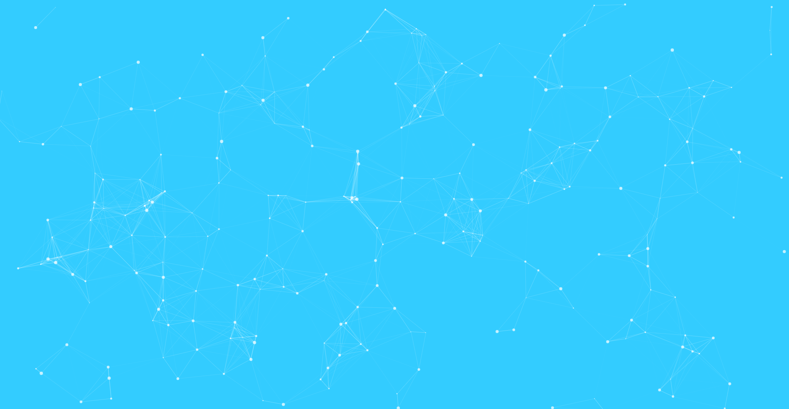

# particle-component

> 在vue中使用particles.js来创建自己的粒子动画组件
# 效果展示



## Build Setup

``` bash
# install dependencies
npm install

# serve with hot reload at localhost:8080
npm run dev

# build for production with minification
npm run build

